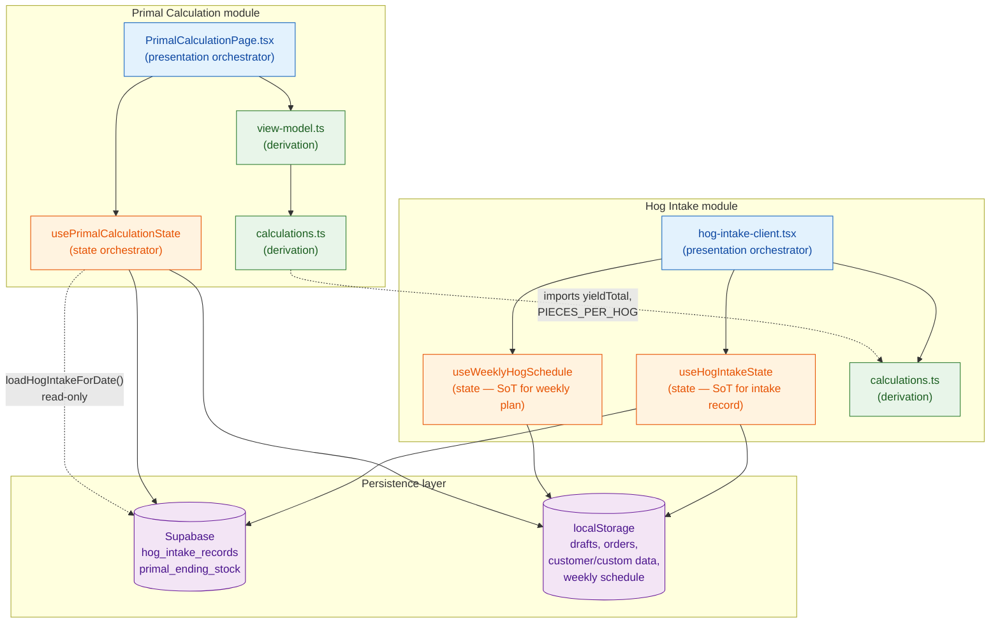
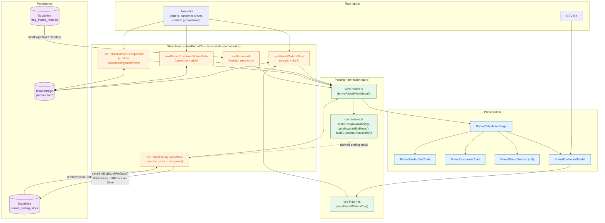
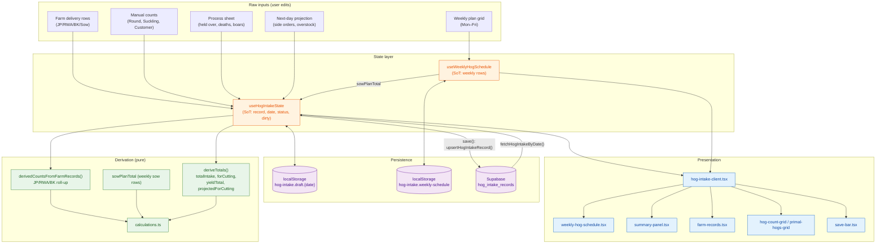
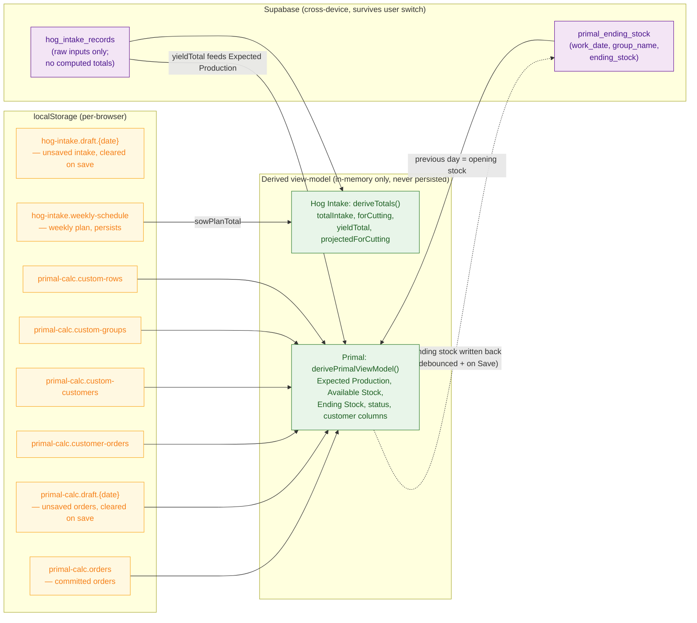

# Hog Intake & Primal Calculation — Architecture

This document describes the architecture of the **Hog Intake** and **Primal Calculation**
modules and how they share state and persistence. All diagrams are Mermaid.

Layer legend used throughout:

- **Presentation** — React components, render-only, no business logic
- **State** — hooks that own raw input state (single source of truth)
- **Derivation** — pure functions that compute derived values (no I/O, no state)
- **Persistence** — Supabase (cross-device) or localStorage (per-browser)

---

## 1. High-Level System Architecture



**Cross-module boundary:** Primal Calculation is a *consumer* of Hog Intake. It reads
hog counts from Supabase (read-only, via `loadHogIntakeForDate`) and imports pure
calculation helpers (`yieldTotal`, `PIECES_PER_HOG`) from the hog-intake module. Hog
Intake has **no** dependency on Primal Calculation — the arrow only points one way.

---

## 2. Primal Calculation — Data Flow



**The core calculation chain** (all in `calculations.ts`, invoked from `view-model.ts`):

```
Expected Production = yieldTotal(hog_counts) × PIECES_PER_HOG   ← from Hog Intake
        + Opening Stock          (per group, from Supabase carry-over)
        − Special Customer Orders (per group, from customer matrix)
        = Available Stock
        − Sales Orders            (catalog SKUs + custom rows, pooled per group)
        = Ending Stock            (derived; carried to next day; status OK/Low/Short)
```

Only the **raw inputs** (orders, customer orders, custom entities) are stored; Expected
Production, Available Stock, Ending Stock, and status are recomputed on every render.

---

## 3. Hog Intake — Data Flow



**Key derivation rule:** `hog_counts` displayed in the summary is **derived**, not raw.
It merges the persisted record's manual counts with farm-record roll-ups (JP/RWA/BK) and
the Sow figure (weekly plan + farm deliveries). Computed totals (total intake, for
cutting, yield, projected) are **never persisted** — they are recomputed wherever shown.

**Resolution order on date load:** non-empty draft → Supabase record → empty record.
The draft is cleared only after a successful Supabase save.

---

## 4. Persistence Map



Note the one feedback edge: **Ending Stock** is a derived value, but because it must
carry over to the next production day across devices, it is written back to Supabase
(`primal_ending_stock`) — debounced ~600ms while editing and explicitly on Save. The
next day reads it back as that day's Opening Stock.

---

## Plain-English Explanation

**Hog Intake** is the upstream module. Each day an operator records how many hogs
arrived (farm delivery rows for JP/RWA/BK/Sow, plus manual counts for Round/Suckling/
Customer), processing adjustments, and a next-day projection. A separate weekly plan
grid (Mon–Fri) feeds the Sow figure. Two hooks own this state:
`useHogIntakeState` owns the daily record and `useWeeklyHogSchedule` owns the weekly
grid. Everything an operator sees as a "total" is computed on the fly by pure functions
in `calculations.ts` — the database only ever stores the raw inputs.

**Primal Calculation** is the downstream module. It reads the day's hog counts from
Hog Intake (read-only) and turns them into expected primal production:
`yieldTotal × PIECES_PER_HOG`. It then folds in yesterday's carried-over stock, special
customer orders, and the day's sales orders to compute, per production group, how much
stock is available and what will be left at end of day (with an OK / Low Reserve / Short
status). All of this derived structure is assembled in one pure function,
`derivePrimalViewModel`, which the page wraps in `useMemo`. The components are purely
presentational — they receive the view-model and render it.

The two modules connect at exactly two points, both one-directional: Primal reads
`hog_intake_records` from Supabase, and Primal's `calculations.ts` imports a couple of
pure helpers from Hog Intake. Hog Intake never imports from Primal.

### Single Source of Truth per dataset

| Dataset | Single source of truth | Backed by |
|---|---|---|
| Daily hog intake record (counts, farm rows, process, next-day) | `useHogIntakeState` | Supabase `hog_intake_records` (+ localStorage draft) |
| Weekly hog plan (Mon–Fri grid, sow plan) | `useWeeklyHogSchedule` | localStorage `hog-intake.weekly-schedule` |
| Primal production orders (catalog SKUs) | `usePrimalOrdersState` | localStorage `primal-calc.orders` (+ draft) |
| Customer order matrix | `usePrimalCustomerOrdersState` | localStorage `primal-calc.customer-orders` |
| Custom customers / groups / rows | `usePrimalCustomGroupsState` | localStorage `primal-calc.custom-*` |
| Opening / ending stock (carry-over) | `usePrimalEndingStockState` | Supabase `primal_ending_stock` |
| Hog counts consumed by Primal | (owned by Hog Intake; read-only here) | Supabase `hog_intake_records` |
| Every "total" / availability / status | **No stored SoT — derived** | `deriveTotals` / `derivePrimalViewModel` |

The rule the codebase follows: a dataset has a single owning hook, and anything that can
be computed from owned state is **never** stored as independent state — it is derived.

### Layer classification

**Presentation (render-only)**
- Hog Intake: `hog-intake-client.tsx`, `weekly-hog-schedule.tsx`, `summary-panel.tsx`,
  `farm-records.tsx`, `hog-count-grid.tsx`, `primal-hogs-grid.tsx`, `process-sheet.tsx`,
  `next-day-projection.tsx`, `save-bar.tsx`
- Primal: `PrimalCalculationPage.tsx`, `PrimalGroupSection.tsx`,
  `PrimalAvailabilityChart.tsx`, `PrimalCustomerChart.tsx`, `PrimalCsvImportModal.tsx`

**State (own raw input, single source of truth)**
- Hog Intake: `useHogIntakeState`, `useWeeklyHogSchedule`
- Primal: `usePrimalCalculationState` (orchestrator) composing `usePrimalOrdersState`,
  `usePrimalCustomerOrdersState`, `usePrimalCustomGroupsState`, `usePrimalEndingStockState`

**Derivation (pure, no I/O)**
- Hog Intake: `calculations.ts` (`deriveTotals`, `derivedCountsFromFarmRecords`,
  `yieldTotal`, `projectedForCutting`, …)
- Primal: `view-model.ts` (`derivePrimalViewModel`), `calculations.ts`
  (`buildGroupAvailability`, `buildAvailabilityRows`, `buildCustomerAvailability`, …),
  `csv-import.ts` (`parsePrimalOrdersCsv` — pure parsing)

**Persistence**
- Hog Intake: `supabase.ts` (`hog_intake_records`), `draft-storage.ts` (localStorage)
- Primal: `primal-storage.ts` (localStorage), `ending-stock-source.ts`
  (Supabase `primal_ending_stock`), `intake-source.ts` (read-only Supabase read of
  `hog_intake_records`)
```

